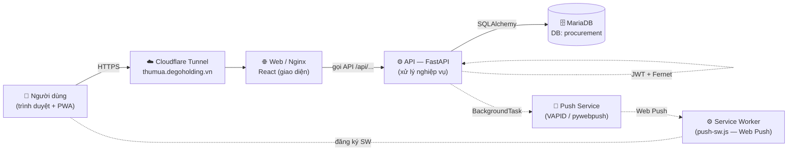
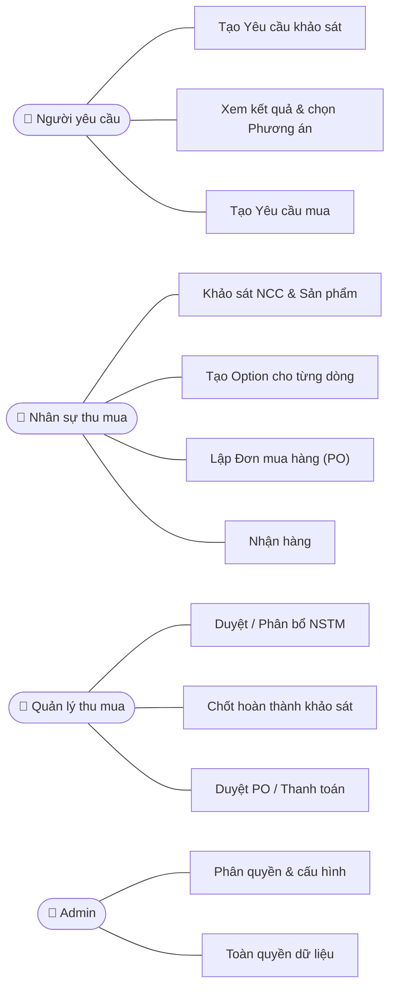
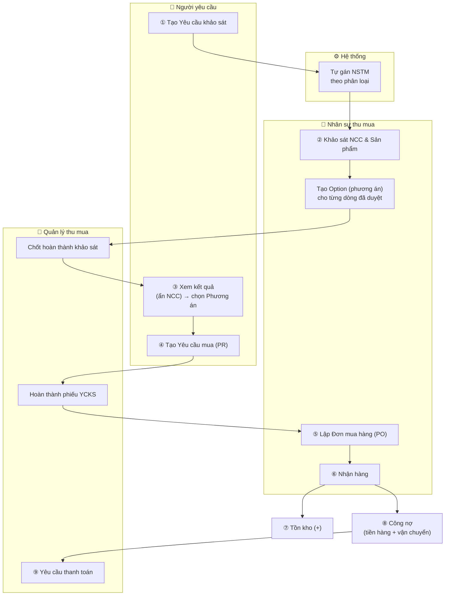
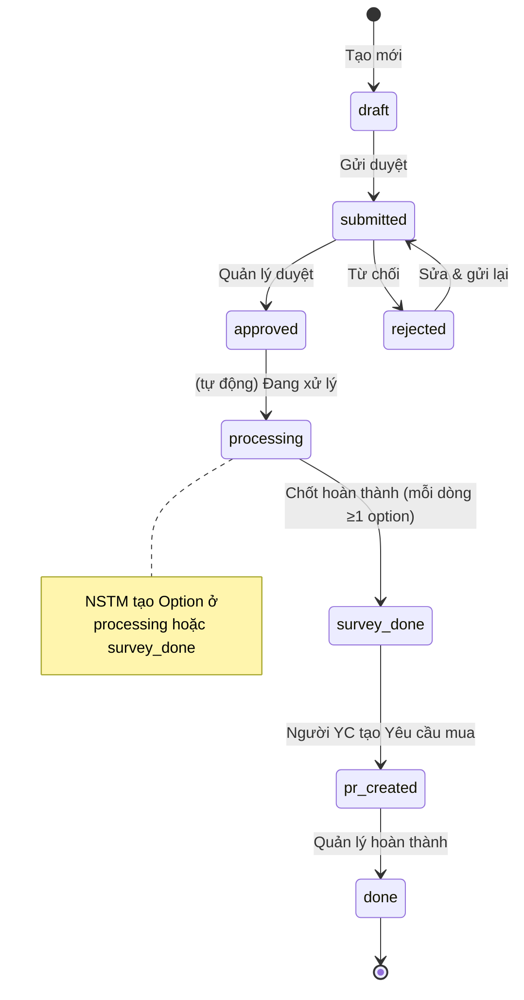
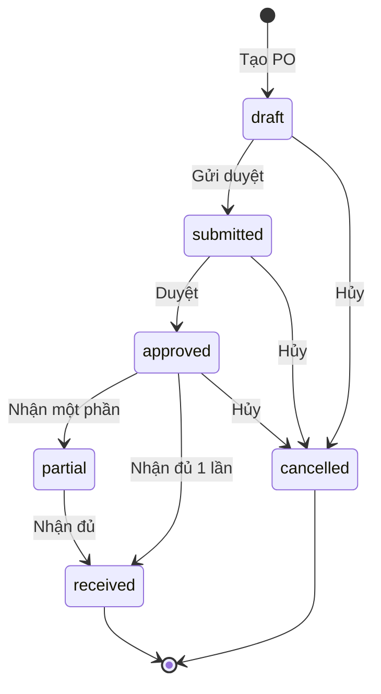
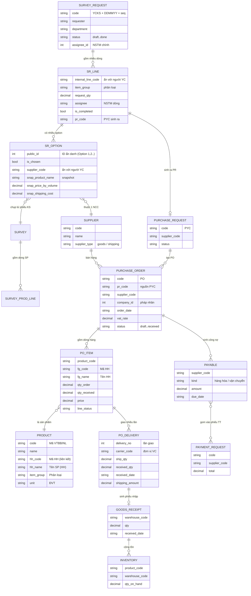
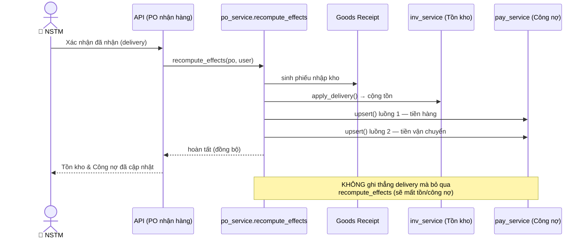
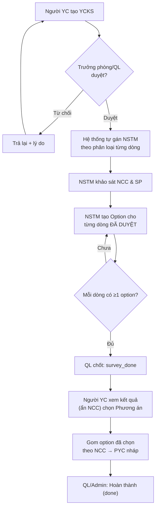
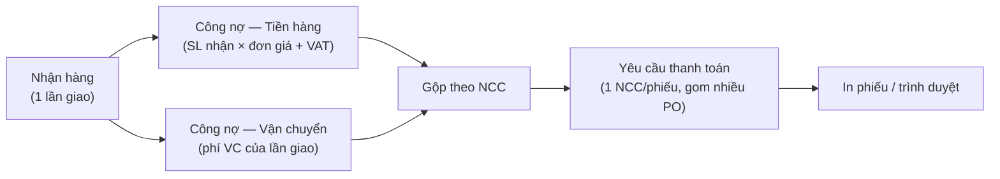

# SƠ ĐỒ KỸ THUẬT — Mini Tool Quản lý Thu Mua
## (Bản vẽ chuẩn — kỹ thuật đọc được, người ngoài cũng hiểu được)

| | |
|---|---|
| **Phiên bản** | v1.1 |
| **Ngày** | 2026-07-15 (cập nhật từ v1.0 2026-07-08) |
| **Chuẩn dùng** | Mermaid (diagram-as-code) — render trên GitHub / VS Code / Mermaid Live; dạng chữ ai cũng đọc được |
| **Đi kèm** | [technical-design.md](technical-design.md) · [quy-trinh-tai-lieu.md](quy-trinh-tai-lieu.md) |

> 💡 Cách xem: mở file này trên **GitHub** hoặc **VS Code** (có extension Mermaid) sẽ thấy hình vẽ. Dán code vào **mermaid.live** để xem/xuất ảnh PNG cho slide/hợp đồng.

---

## 1. Sơ đồ kiến trúc hệ thống (Architecture)
*Người ngoài hiểu: trình duyệt → web → máy chủ xử lý → cơ sở dữ liệu.*

> **PWA**: `vite-plugin-pwa` bake service worker vào bản build prod (`registerType: prompt`; SW tắt ở dev). Workbox precache asset tĩnh; `/api/*` luôn `NetworkOnly`. Handler push: `public/push-sw.js` được `importScripts` vào SW. Toggle banner "Cài ứng dụng": build arg `VITE_PWA_INSTALL_PROMPT=on`.

---

## 2. Bản đồ chức năng theo vai trò (Use-case)
*Người ngoài hiểu: ai làm được việc gì trong hệ thống.*

---

## 3. Luồng nghiệp vụ end-to-end (theo vai trò) ⭐
*Đây là "bản vẽ xây nhà" chính. Mỗi khung là một vai trò.*

---

## 4. Vòng đời trạng thái — Yêu cầu khảo sát (State machine)
*Người ngoài hiểu: phiếu đi qua những trạng thái nào, ai bấm nút gì để chuyển.*

---

## 5. Vòng đời trạng thái — Đơn mua hàng (PO)
*Người ngoài hiểu: đơn hàng từ nháp đến nhận đủ.*

---

## 6. Mô hình dữ liệu (ERD — Entity Relationship)
*Kỹ thuật đọc: các bảng và quan hệ. `||--o{` = một–nhiều.*

---

## 7. Trình tự "Nhận hàng → Tồn kho + Công nợ" (Sequence)
*Kỹ thuật đọc: vì sao một thao tác nhận hàng lại tự sinh cả tồn kho lẫn công nợ.*

---

## 8. Luồng chi tiết: Yêu cầu khảo sát 5A → 5D (có điểm quyết định)
*Chi tiết hơn sơ đồ 3 — thể hiện nhánh duyệt / trả lại và ai làm ở bước nào.*

---

## 9. Luồng công nợ & thanh toán (2 luồng)
*Vì sao mỗi lần nhận hàng lại sinh 2 khoản nợ, rồi gom thành phiếu thanh toán.*

---

## 10. Ghi chú cho người đọc

- **Sơ đồ 1–5, 8, 9** dễ cho **người ngoài** (phòng Thu mua) đọc để nắm luồng & quyết định.
- **Sơ đồ 6–7** thiên về **kỹ thuật** (data model đầy đủ + trình tự xử lý).
- **Sơ đồ 1** (v1.1): cập nhật thêm lớp PWA/Service Worker + Web Push (VAPID) — xem CR-002 trong [change-log.md](change-log.md).
- Mọi sơ đồ khớp hệ thống thật (trạng thái, bảng, hàm đúng tên). Khi luồng đổi → cập nhật sơ đồ **kèm Change Request** trong [change-log.md](change-log.md).

*Hết. Chi tiết mô tả xem [technical-design.md](technical-design.md).*
